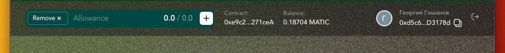

# Track 1: Gaming Wallets - Quv.io
* Quv Project: https://crowdhack.io/project/641c96d94e386b00362a5c3d
* Demo Link: https://coral-app-nku3e.ondigitalocean.app/
* Github Link: https://github.com/PinkiNice/quv-hack

`Challenge: Build EVM compatible social/gaming Web 3 wallets with unique characteristics that could enhance the gaming experience for players. We are looking for wallets that can provide seamless and secure gameplay, where players do not have to sign in every time they call a contract that they have authenticated in the past. The social wallet could showcase NFTs, branding related to Playnance, or other features that will be suggested by creators. For this track we accept both prototype work, but also for implementations that are building on top of an existing open-source project. `

## How to run the demo

* Clone the repository
* `npm install`
* `npx parcel src/index.html`
* Open localhost:1234 in your browser
* Make sure to allow 3rd party cookies in your browser for the demo to work.
* Click Google Icon to login into QUV
* Start signing transactions to play the game by clicking buttons on the bottom of the screen!
  
## About Quv
https://app.quv.io/

QUV is a cryptocurrency web-wallet with focus on payments & ease of use.
QUV uses email based logins, which allows user to create a wallet by using Google (or Twitter, or Discord - any OAuth2 provider). This allows users to create a wallet without having to remember a password, and also allows them to use the same wallet across multiple devices. This is a very important feature for mobile users, as they can use the same wallet on their phone and on their desktop.

QUV design is responsive which allows for seamless experience on mobile devices.

## Made during the hackathon

During the hackathon we added an allowance system into Quv, which allows 3rd party apps to request signatures from the user. This allows for a seamless experience, where the user does not have to sign in every time they call a contract that they have authenticated in the past.

* The system is auto-syncing between tabs, browser and devices. This means that if the user approves an allowance in one tab, it will be approved in all other tabs and devices immediately. Seamless experience!
* Allowance is tied to a QUV account - not to the browser or tab. This means that if the user logs in to QUV on another device, the allowances will be available there as well.
* Approve once - sign while you have enough funds. Once allowance runs out, QUV notifies parents app (e.g. game) and allows the user to refresh the allowance.
* Upon rendering QUV notifies the parent app about the user's allowance status and login status. No need to bother MetaMask users with extra clicks, render QUV only when it is needed!

## Allowance System explained
It consists of several parts:

1. Back-end which allows user to update and see their allowances.
2. Front-end application which signs transactions and verifies allowances on behalf of the user.
3. Demo application (this repository) which uses the allowance system to allow users to play a game without having to sign transactions every time.

### How does it work? 🤓
The Game (in the case of the demo - Playnance) adds Quv iframe into their game page. The iframe is loaded with a special URL which contains the contract address:

For Example (playnance mumbai contract): https://coral-app-nku3e.ondigitalocean.app/iframe/0xe9c238201373FA63E402f85Ff7d954782F271ceA

The Game can choose between using invisible and visible mode. 
Quv will update The Game with state changes (e.g. user logged in, user logged out, allowance added, allowance removed, etc.) during the game session, so The Game can react accordingly and update interface.

Or The Game may default to visible mode, which will show the Quv iframe at all times. Iframe itself shows a progress bar of the remaining allowance, and a button to proceed to refresh the allowance.

### Can it be used in Android/iOS apps? 📱
Yes it can. QUV can be integrated the same way as on web apps using WebView component and using the same communication mechanism.

### How is the security? 👺🤖

* Communication between Game and Quv is done via iframe communication mechanism. In the production version every game will have its own iframe, deployed on a sub-domain of quv, limited to single game domain, so there is no way for one game to access another game's iframe. 
* Transaction execution is limited to a single contract address, which limits the damage that can be done by a malicious game, in case user approves the allowance.
* In production version, The Game will be asked to pre-list all the contract addresses that they will be using. This will allow Quv to verify that the contract address in the URL is one of the pre-approved addresses. This will prevent a malicious game from using a different contract address to execute transactions. (For example transferring all USDT tokens from user account)

### What is in the demo? 🤌

Demo renders a Playnance UpVsDown game in an iframe solely for demonstration purposes. The game is not part of the hackathon submission. It used here to show that transactions can be executed without user signature request.

Two buttons on the bottom (see pic) are part of the demo - they are not a part of the iframe. They allow the user to make bets for the game using Quv signature magic!

### Next Steps 🚀
* Create merchant dashboard to control whitelisted contract addresses and domains.
* Add support for multiple contract addresses
* Recreate allowance system on blockchain (using smart contracts) for stronger security (and becoming more web3 based).
* Create an QuvSignSDK for developers to integrate into their apps with few lines of code.

### Limitations
Because of iframe communication nature and web-based logins, our wallet relies on cookies to maintain user session. This means that the user will have to allow cookies in order to use the wallet. 

